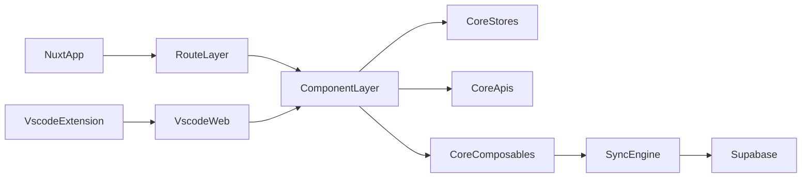

# TypeWords 功能列表（人类友好 + AI可读）

## 文档说明

- 这是一份单文档双层结构：
  - 前半：给人读，快速理解“项目有什么功能、在哪、现在什么状态”
  - 后半：给 AI 读，提供稳定锚点（ID、路径、状态、维护规则）
- 事实来源是当前代码仓库，不包含未实现的想象需求。
- 最近复查时间：`2026-03-23`

---

## 1. 项目一眼看懂

TypeWords 是一个以“英语打字练习”为核心的多端项目：

- 主站：`apps/nuxt`
- Web 子集端（给 Webview/轻量场景）：`apps/vscode-web`
- VSCode 扩展外壳：`apps/vscode`
- 共享业务能力：`packages/core`
- 通用 UI 组件：`packages/base`

核心业务模块：

- `words`：单词学习/练习/测试
- `articles`：文章练习与编辑
- `setting`：全局设置、FSRS、数据与同步
- `sync`：本地持久化 + Supabase 双向同步
- `user`/`vip`：账号与会员相关能力
- `platform`：应用壳层、帮助、文档、扩展承载

---

## 2. 项目结构（人类视角）

### 2.1 应用层

- `apps/nuxt/app/pages`：主业务页面路由（最全）
- `apps/nuxt/app/layouts`：布局壳（默认布局、空布局）
- `apps/nuxt/app/plugins`：客户端插件（SW、统计、指令）
- `apps/vscode-web/src/pages`：轻量页面子集
- `apps/vscode/src/extension.ts`：VSCode 命令与 Webview 承载

### 2.2 共享能力层

- `packages/core/src/components`：业务组件（单词、文章、设置等）
- `packages/core/src/stores`：Pinia 状态中心
- `packages/core/src/composables`：初始化与同步组合式逻辑
- `packages/core/src/apis`：后端 API 封装
- `packages/core/src/hooks`：练习、声音、事件、FSRS 逻辑
- `packages/base/src`：基础组件（Dialog/Form/Toast/Select 等）

---

## 3. 功能总览（按模块）

### 3.1 Words（单词）

核心能力：

- 词书列表、词典详情、编辑管理
- 单词练习（多模式、多阶段）
- 单词测试（选择题流程）
- FSRS 数据查看

主要入口：

- `/words`、`/dict-list`、`/dict`
- `/practice-words/:id`、`/words-test/:id`
- `/fsrs`

现状：

- 主流程完整可用（implemented）

关键页面证据：

- `apps/nuxt/app/pages/(words)/words.vue`
- `apps/nuxt/app/pages/(words)/dict-list.vue`
- `apps/nuxt/app/pages/(words)/dict.vue`
- `apps/nuxt/app/pages/(words)/practice-words/[id].vue`
- `apps/nuxt/app/pages/(words)/words-test/[id].vue`
- `apps/nuxt/app/pages/fsrs.vue`

### 3.2 Articles（文章）

核心能力：

- 文章书籍入口、列表与详情
- 文章练习
- 批量编辑文章

主要入口：

- `/articles`、`/book-list`、`/book`、`/book/:id`
- `/practice-articles/:id`
- `/batch-edit-article`

现状：

- 主流程完整可用（implemented）

关键页面证据：

- `apps/nuxt/app/pages/(articles)/articles.vue`
- `apps/nuxt/app/pages/(articles)/book-list.vue`
- `apps/nuxt/app/pages/(articles)/book/index.vue`
- `apps/nuxt/app/pages/(articles)/book/[id].vue`
- `apps/nuxt/app/pages/(articles)/practice-articles/[id].vue`
- `apps/nuxt/app/pages/(articles)/batch-edit-article.vue`

### 3.3 Setting（设置）

核心能力：

- 通用设置、单词设置、文章设置
- FSRS 参数配置
- 备份、恢复、同步相关入口

主要入口：

- `/setting`

现状：

- 功能完整且为系统中枢（implemented）

关键证据：

- `apps/nuxt/app/pages/setting.vue`
- `packages/core/src/components/setting/SettingDialog.vue`
- `packages/core/src/components/setting/FsrsSetting.vue`

### 3.4 Sync（数据与同步）

核心能力：

- 本地持久化（IDB + localStorage）
- 初始化加载（user/base/setting）
- Supabase 双向同步（dict/setting/practice_word/practice_article）
- 版本快照守护与备份

现状：

- 主链路可用（implemented）
- 有特定边界：自定义文章含自定义音频时会阻断同步

关键证据：

- `packages/core/src/composables/useInit.ts`
- `packages/core/src/composables/useDataSyncPersistence.ts`
- `packages/core/src/utils/supabase.ts`

### 3.5 User / VIP（账号与会员）

核心能力：

- 登录、注册、验证码、重置密码
- 用户中心资料管理
- 会员权益、下单、订单查询、自动续费

主要入口：

- `/login`、`/user`、`/vip`

现状：

- 前端能力存在，但整体链路依赖外部后端（partial）

关键证据：

- `apps/nuxt/app/pages/(user)/login.vue`
- `apps/nuxt/app/pages/(user)/user.vue`
- `apps/nuxt/app/pages/(user)/vip.vue`
- `packages/core/src/apis/user.ts`
- `packages/core/src/apis/member.ts`

### 3.6 Platform（壳层与多端承载）

核心能力：

- 首页/帮助/反馈/文档等非练习页
- 默认布局初始化与全局导航
- 客户端插件（SW、统计）
- vscode-web 轻量路由承载
- VSCode 扩展 Webview 承载

现状：

- Nuxt 主站完整
- vscode-web 是能力子集（以 words + setting 为主）

关键证据：

- `apps/nuxt/app/layouts/default.vue`
- `apps/nuxt/app/plugins/02.init.client.ts`
- `apps/vscode-web/src/router.ts`
- `apps/vscode/src/extension.ts`

---

## 4. 关键流程（人类友好）

### 4.1 学习流程（单词/文章）

1. 进入列表页选择词书或文章书
2. 进入练习页执行打字练习
3. 练习过程更新 `practice` 状态与统计
4. 进度持久化到本地，并在可用时同步到远端

关键链路：

- 页面入口：`apps/nuxt/app/pages/(words)/...`、`apps/nuxt/app/pages/(articles)/...`
- 组件执行：`packages/core/src/components/word/TypeWord.vue`、`packages/core/src/components/article/TypingArticle.vue`

### 4.2 同步流程

1. `useInit` 启动时初始化 user/base/setting
2. 调用 `pullRemoteIfNewer` 拉取远端较新数据
3. base/setting 变化通过订阅触发 `saveLocalAndSync`
4. 按比较策略决定“本地覆盖远端”或“远端覆盖本地”

关键链路：

- `packages/core/src/composables/useInit.ts`
- `packages/core/src/composables/useDataSyncPersistence.ts`

### 4.3 账号与会员流程

1. 登录页触发 user API
2. 用户中心维护资料
3. 会员页调用 member API 完成下单与状态查询

关键链路：

- `packages/core/src/apis/user.ts`
- `packages/core/src/apis/member.ts`

---

## 5. 已知缺口与边界

- `vscode-web` 目前只启用了单词与设置路由，文章路由仍为注释状态  
  - 证据：`apps/vscode-web/src/router.ts`
- `vscode-web` 的 words 页面存在 `/fsrs` 跳转，但路由未注册  
  - 证据：`apps/vscode-web/src/pages/(words)/words.vue`、`apps/vscode-web/src/router.ts`
- 默认侧栏中的“用户入口”处于注释状态，可发现性偏弱  
  - 证据：`apps/nuxt/app/layouts/default.vue`
- `/nce`、`/test` 更偏占位/调试，不是稳定业务主路径  
  - 证据：`apps/nuxt/app/pages/nce.vue`、`apps/nuxt/app/pages/test.vue`

---

## 6. 快速索引（给人用）

### 6.1 按入口找功能

- 学单词：`/words` -> `dict-list/dict` -> `/practice-words/:id`
- 单词测试：`/words-test/:id`
- 学文章：`/articles` -> `/book-list`/`/book/:id` -> `/practice-articles/:id`
- 批量改文章：`/batch-edit-article`
- 设置/同步：`/setting`
- 登录/会员：`/login`、`/user`、`/vip`
- 帮助与资源：`/help`、`/doc`

### 6.2 按目录找功能

- 路由页面：`apps/nuxt/app/pages`
- 业务组件：`packages/core/src/components`
- 状态与同步：`packages/core/src/stores` + `packages/core/src/composables`
- API：`packages/core/src/apis`

---

## AI_INDEX

以下章节提供稳定锚点，便于其他 AI 自动读取。

### AI_FEATURE_IDS

格式：`ID | 模块 | 名称 | 状态 | 位置`


| ID              | 模块       | 名称                          | 状态          | 位置                                                            |
| --------------- | -------- | --------------------------- | ----------- | ------------------------------------------------------------- |
| RF-WORDS-001    | words    | 单词模块首页与学习入口                 | implemented | `apps/nuxt/app/pages/(words)/words.vue`                       |
| RF-WORDS-002    | words    | 词书列表与分组选择                   | implemented | `apps/nuxt/app/pages/(words)/dict-list.vue`                   |
| RF-WORDS-003    | words    | 词典详情与编辑管理                   | implemented | `apps/nuxt/app/pages/(words)/dict.vue`                        |
| RF-WORDS-004    | words    | 单词练习主流程                     | implemented | `apps/nuxt/app/pages/(words)/practice-words/[id].vue`         |
| RF-WORDS-005    | words    | 单词测试流程                      | implemented | `apps/nuxt/app/pages/(words)/words-test/[id].vue`             |
| RF-WORDS-006    | words    | FSRS 数据查看页                  | implemented | `apps/nuxt/app/pages/fsrs.vue`                                |
| RF-ARTICLES-001 | articles | 文章模块首页与书籍入口                 | implemented | `apps/nuxt/app/pages/(articles)/articles.vue`                 |
| RF-ARTICLES-002 | articles | 书籍列表页                       | implemented | `apps/nuxt/app/pages/(articles)/book-list.vue`                |
| RF-ARTICLES-003 | articles | 书籍详情页（index）                | implemented | `apps/nuxt/app/pages/(articles)/book/index.vue`               |
| RF-ARTICLES-004 | articles | 书籍详情页（动态）                   | implemented | `apps/nuxt/app/pages/(articles)/book/[id].vue`                |
| RF-ARTICLES-005 | articles | 文章批量编辑页                     | implemented | `apps/nuxt/app/pages/(articles)/batch-edit-article.vue`       |
| RF-ARTICLES-006 | articles | 文章练习主流程                     | implemented | `apps/nuxt/app/pages/(articles)/practice-articles/[id].vue`   |
| RF-USER-001     | user     | 登录注册与找回密码页                  | partial     | `apps/nuxt/app/pages/(user)/login.vue`                        |
| RF-USER-002     | user     | 用户中心页                       | partial     | `apps/nuxt/app/pages/(user)/user.vue`                         |
| RF-VIP-001      | vip      | 会员与支付页                      | partial     | `apps/nuxt/app/pages/(user)/vip.vue`                          |
| RF-SETTING-001  | setting  | 设置中心总页                      | implemented | `apps/nuxt/app/pages/setting.vue`                             |
| RF-PLATFORM-001 | platform | 首页（空布局）                     | implemented | `apps/nuxt/app/pages/index.vue`                               |
| RF-PLATFORM-002 | platform | 帮助页                         | implemented | `apps/nuxt/app/pages/help.vue`                                |
| RF-PLATFORM-003 | platform | 反馈页                         | implemented | `apps/nuxt/app/pages/feedback.vue`                            |
| RF-PLATFORM-004 | platform | 资源文档页                       | implemented | `apps/nuxt/app/pages/doc.vue`                                 |
| RF-PLATFORM-005 | platform | 新概念占位页                      | partial     | `apps/nuxt/app/pages/nce.vue`                                 |
| RF-PLATFORM-006 | platform | 测试调试页                       | partial     | `apps/nuxt/app/pages/test.vue`                                |
| RF-PLATFORM-007 | platform | vscode-web 路由子集承载           | implemented | `apps/vscode-web/src/router.ts`                               |
| RF-PLATFORM-008 | platform | VSCode 扩展 Webview 入口        | implemented | `apps/vscode/src/extension.ts`                                |
| CF-WORDS-001    | words    | TypeWord 练习组件               | implemented | `packages/core/src/components/word/TypeWord.vue`              |
| CF-WORDS-002    | words    | 单词练习统计组件                    | implemented | `packages/core/src/components/word/Statistics.vue`            |
| CF-WORDS-003    | words    | 练习设置对话框                     | implemented | `packages/core/src/components/word/PracticeSettingDialog.vue` |
| CF-ARTICLES-001 | articles | TypingArticle 文章练习组件        | implemented | `packages/core/src/components/article/TypingArticle.vue`      |
| CF-ARTICLES-002 | articles | EditArticle 文章编辑组件          | implemented | `packages/core/src/components/article/EditArticle.vue`        |
| CF-ARTICLES-003 | articles | EditBook 书籍编辑组件             | implemented | `packages/core/src/components/article/EditBook.vue`           |
| CF-SETTING-001  | setting  | SettingDialog 设置总对话框        | implemented | `packages/core/src/components/setting/SettingDialog.vue`      |
| CF-SETTING-002  | setting  | FsrsSetting 记忆参数配置          | implemented | `packages/core/src/components/setting/FsrsSetting.vue`        |
| CF-SYNC-001     | sync     | BackupGateDialog 备份门闸       | implemented | `packages/core/src/components/dialog/BackupGateDialog.vue`    |
| CF-SYNC-002     | sync     | MigrateDialog 老站迁移组件        | implemented | `packages/core/src/components/dialog/MigrateDialog.vue`       |
| CF-SYNC-003     | sync     | 同步冲突提示组件组                   | implemented | `packages/core/src/components/dialog/ConflictNotice.vue`      |
| CF-PLATFORM-001 | platform | PracticeLayout 练习壳层         | implemented | `packages/core/src/components/PracticeLayout.vue`             |
| CF-PLATFORM-002 | platform | 默认布局初始化链路                   | implemented | `apps/nuxt/app/layouts/default.vue`                           |
| CF-PLATFORM-003 | platform | init.client 客户端插件           | implemented | `apps/nuxt/app/plugins/02.init.client.ts`                        |
| CF-PLATFORM-004 | platform | vscode-web Nuxt polyfill 层  | implemented | `apps/vscode-web/src/main.ts`                                 |
| CF-SYNC-004     | sync     | useInit 初始化与订阅同步            | implemented | `packages/core/src/composables/useInit.ts`                    |
| CF-SYNC-005     | sync     | useDataSyncPersistence 同步引擎 | implemented | `packages/core/src/composables/useDataSyncPersistence.ts`     |
| CF-BASE-001     | platform | Base UI 导出集合                | implemented | `packages/base/src/index.ts`                                  |


### AI_EVIDENCE_ROOT

```json
{
  "nuxtPages": "apps/nuxt/app/pages",
  "nuxtLayouts": "apps/nuxt/app/layouts",
  "nuxtPlugins": "apps/nuxt/app/plugins",
  "vscodeWeb": "apps/vscode-web/src",
  "vscodeExt": "apps/vscode/src",
  "core": "packages/core/src",
  "base": "packages/base/src"
}
```

### AI_UPDATE_RULES

```json
{
  "idConvention": {
    "route": "RF-{MODULE}-{NNN}",
    "component": "CF-{MODULE}-{NNN}"
  },
  "statusConvention": ["implemented", "partial", "planned"],
  "minimumRequirement": [
    "每条功能必须有 ID、状态、位置路径",
    "新增功能优先补到人类层对应模块，再更新 AI_FEATURE_IDS",
    "删除功能时不要复用旧 ID"
  ],
  "consistencyRule": [
    "若本文与其他 PRD 冲突，以代码路径为准",
    "每次修改后更新文档顶部的最近复查时间"
  ]
}
```

# TypeWords 全量功能地图（页面+关键组件级）

## meta

```json
{
  "project": "TypeWords",
  "docType": "project-feature-map",
  "audience": ["human-maintainer", "ai-agent"],
  "version": "1.0.0",
  "updatedAt": "2026-03-23",
  "granularity": "route+key-component",
  "sourceOfTruth": "repository",
  "coverage": {
    "apps": ["apps/nuxt", "apps/vscode-web", "apps/vscode"],
    "packages": ["packages/core", "packages/base"]
  }
}
```

## systemMap

```json
{
  "applications": [
    {
      "name": "Nuxt Web",
      "path": "apps/nuxt",
      "role": "主站与完整业务路由承载"
    },
    {
      "name": "vscode-web",
      "path": "apps/vscode-web",
      "role": "轻量路由子集，供 Webview/独立页面复用"
    },
    {
      "name": "VSCode Extension",
      "path": "apps/vscode",
      "role": "Webview 外壳，通过 CDN 动态加载前端资源"
    }
  ],
  "sharedPackages": [
    {
      "name": "core",
      "path": "packages/core/src",
      "role": "业务组件、状态、同步、API 与 hooks"
    },
    {
      "name": "base",
      "path": "packages/base/src",
      "role": "基础 UI 组件与表单/对话/提示能力"
    }
  ]
}
```




## routeFeatureIndex

### Nuxt 路由清单

```json
{
  "words": ["/words", "/dict-list", "/dict", "/practice-words/:id", "/words-test/:id", "/fsrs"],
  "articles": ["/articles", "/book-list", "/book", "/book/:id", "/batch-edit-article", "/practice-articles/:id"],
  "user": ["/login", "/user", "/vip"],
  "setting": ["/setting"],
  "platform": ["/", "/help", "/feedback", "/doc", "/nce", "/test"]
}
```

### vscode-web 路由清单（当前启用）

```json
{
  "enabled": ["/words", "/dict-list", "/dict", "/practice-words/:id", "/word-test/:id", "/setting"],
  "disabledByComment": ["/articles", "/book-list", "/book", "/practice-articles/:id"],
  "catchAllRedirect": "/words"
}
```

## componentFeatureIndex

```json
{
  "words": [
    "components/word/TypeWord.vue",
    "components/word/Footer.vue",
    "components/word/Statistics.vue",
    "components/word/PracticeSettingDialog.vue",
    "components/word/ShufflePracticeSettingDialog.vue",
    "components/word/PracticeWordListDialog.vue",
    "components/word/ChangeLastPracticeIndexDialog.vue",
    "components/list/WordList.vue"
  ],
  "articles": [
    "components/article/TypingArticle.vue",
    "components/article/TypingWord.vue",
    "components/article/EditArticle.vue",
    "components/article/EditBook.vue",
    "components/article/EditSingleArticleModal.vue",
    "components/article/ArticleAudio.vue",
    "components/list/ArticleList.vue"
  ],
  "setting": [
    "components/setting/SettingDialog.vue",
    "components/setting/CommonSetting.vue",
    "components/setting/WordSetting.vue",
    "components/setting/ArticleSetting.vue",
    "components/setting/FsrsSetting.vue"
  ],
  "sync": [
    "components/dialog/BackupGateDialog.vue",
    "components/dialog/MigrateDialog.vue",
    "components/dialog/ConflictNotice.vue",
    "components/dialog/ConflictNotice2.vue",
    "components/dialog/ConflictNoticeText.vue"
  ],
  "platform": [
    "components/PracticeLayout.vue",
    "components/Header.vue",
    "components/Book.vue",
    "components/ResourceCard.vue",
    "components/list/DictList.vue",
    "components/dialog/IeDialog.vue"
  ],
  "baseUi": [
    "packages/base/src/Dialog.vue",
    "packages/base/src/MiniDialog.vue",
    "packages/base/src/BaseButton.vue",
    "packages/base/src/select/Select.vue",
    "packages/base/src/form/Form.vue",
    "packages/base/src/toast/Toast.ts"
  ]
}
```

## featureItems

以下条目为标准化结构，供你持续更新，也供其他 AI 程序化读取。

```json
[
  {
    "id": "RF-WORDS-001",
    "layer": "route",
    "module": "words",
    "name": "单词模块首页与学习入口",
    "location": "apps/nuxt/app/pages/(words)/words.vue",
    "entry": ["/words"],
    "dependencies": ["packages/core/src/stores/base.ts", "packages/core/src/stores/setting.ts", "packages/core/src/composables/usePracticePersistence.ts"],
    "behavior": "展示当前词书进度、推荐词书、练习模式入口与学习跳转。",
    "acceptance": ["进入 /words 可见词书与练习入口", "可跳转到词典页或练习页"],
    "status": "implemented",
    "evidence": ["apps/nuxt/app/pages/(words)/words.vue"],
    "lastReviewedAt": "2026-03-23"
  },
  {
    "id": "RF-WORDS-002",
    "layer": "route",
    "module": "words",
    "name": "词书列表与分组选择",
    "location": "apps/nuxt/app/pages/(words)/dict-list.vue",
    "entry": ["/dict-list"],
    "dependencies": ["packages/core/src/components/list/DictList.vue", "packages/core/src/config/env.ts"],
    "behavior": "拉取词书清单，支持搜索/分组并选择词书。",
    "acceptance": ["可加载词书列表", "可点击词书进入详情或学习链路"],
    "status": "implemented",
    "evidence": ["apps/nuxt/app/pages/(words)/dict-list.vue"],
    "lastReviewedAt": "2026-03-23"
  },
  {
    "id": "RF-WORDS-003",
    "layer": "route",
    "module": "words",
    "name": "词典详情与编辑管理",
    "location": "apps/nuxt/app/pages/(words)/dict.vue",
    "entry": ["/dict"],
    "dependencies": ["packages/core/src/components/BaseTable.vue", "packages/core/src/components/word/WordItem.vue", "packages/core/src/apis/words.ts"],
    "behavior": "编辑词典元信息、单词项、导入导出，并可发起练习/测试。",
    "acceptance": ["词典详情可编辑并保存", "可跳转到练习或测试页"],
    "status": "implemented",
    "evidence": ["apps/nuxt/app/pages/(words)/dict.vue"],
    "lastReviewedAt": "2026-03-23"
  },
  {
    "id": "RF-WORDS-004",
    "layer": "route",
    "module": "words",
    "name": "单词练习主流程",
    "location": "apps/nuxt/app/pages/(words)/practice-words/[id].vue",
    "entry": ["/practice-words/:id"],
    "dependencies": ["packages/core/src/stores/practice.ts", "packages/core/src/components/word/TypeWord.vue", "packages/core/src/hooks/fsrs.ts"],
    "behavior": "按练习模式执行阶段化练习，统计进度与错词并更新复习数据。",
    "acceptance": ["进入后能开始打字练习", "练习进度和统计可更新"],
    "status": "implemented",
    "evidence": ["apps/nuxt/app/pages/(words)/practice-words/[id].vue"],
    "lastReviewedAt": "2026-03-23"
  },
  {
    "id": "RF-WORDS-005",
    "layer": "route",
    "module": "words",
    "name": "单词测试流程",
    "location": "apps/nuxt/app/pages/(words)/words-test/[id].vue",
    "entry": ["/words-test/:id"],
    "dependencies": ["packages/core/src/hooks/sound.ts", "packages/core/src/stores/base.ts"],
    "behavior": "执行选择题型单词测试，记录答题与错词。",
    "acceptance": ["进入测试页可完成选择题", "错题可进入错词集"],
    "status": "implemented",
    "evidence": ["apps/nuxt/app/pages/(words)/words-test/[id].vue"],
    "lastReviewedAt": "2026-03-23"
  },
  {
    "id": "RF-WORDS-006",
    "layer": "route",
    "module": "words",
    "name": "FSRS 数据查看页",
    "location": "apps/nuxt/app/pages/fsrs.vue",
    "entry": ["/fsrs"],
    "dependencies": ["packages/core/src/stores/base.ts"],
    "behavior": "以表格方式展示 FSRS 卡片数据。",
    "acceptance": ["进入 /fsrs 可查看卡片状态列表"],
    "status": "implemented",
    "evidence": ["apps/nuxt/app/pages/fsrs.vue"],
    "lastReviewedAt": "2026-03-23"
  },
  {
    "id": "RF-ARTICLES-001",
    "layer": "route",
    "module": "articles",
    "name": "文章模块首页与书籍入口",
    "location": "apps/nuxt/app/pages/(articles)/articles.vue",
    "entry": ["/articles"],
    "dependencies": ["packages/core/src/stores/base.ts", "packages/core/src/composables/usePracticePersistence.ts"],
    "behavior": "展示当前书籍、推荐书籍与文章练习入口。",
    "acceptance": ["进入 /articles 可见书籍与入口", "可跳转到文章练习"],
    "status": "implemented",
    "evidence": ["apps/nuxt/app/pages/(articles)/articles.vue"],
    "lastReviewedAt": "2026-03-23"
  },
  {
    "id": "RF-ARTICLES-002",
    "layer": "route",
    "module": "articles",
    "name": "书籍列表页",
    "location": "apps/nuxt/app/pages/(articles)/book-list.vue",
    "entry": ["/book-list"],
    "dependencies": ["packages/core/src/components/list/DictList.vue", "packages/core/src/config/env.ts"],
    "behavior": "展示文章书单并提供搜索与导航。",
    "acceptance": ["书单可加载并可跳到详情页"],
    "status": "implemented",
    "evidence": ["apps/nuxt/app/pages/(articles)/book-list.vue"],
    "lastReviewedAt": "2026-03-23"
  },
  {
    "id": "RF-ARTICLES-003",
    "layer": "route",
    "module": "articles",
    "name": "书籍详情页（index）",
    "location": "apps/nuxt/app/pages/(articles)/book/index.vue",
    "entry": ["/book"],
    "dependencies": ["packages/core/src/components/article/ArticleAudio.vue", "packages/core/src/components/article/EditBook.vue"],
    "behavior": "展示书籍文章、支持编辑/重置并发起练习。",
    "acceptance": ["可浏览文章列表", "可跳转 practice-articles"],
    "status": "implemented",
    "evidence": ["apps/nuxt/app/pages/(articles)/book/index.vue"],
    "lastReviewedAt": "2026-03-23"
  },
  {
    "id": "RF-ARTICLES-004",
    "layer": "route",
    "module": "articles",
    "name": "书籍详情页（动态）",
    "location": "apps/nuxt/app/pages/(articles)/book/[id].vue",
    "entry": ["/book/:id"],
    "dependencies": ["packages/core/src/hooks/dict.ts", "packages/core/src/components/article/EditBook.vue"],
    "behavior": "按 ID 加载并展示指定书籍详情。",
    "acceptance": ["动态路由可正确加载对应书籍数据"],
    "status": "implemented",
    "evidence": ["apps/nuxt/app/pages/(articles)/book/[id].vue"],
    "lastReviewedAt": "2026-03-23"
  },
  {
    "id": "RF-ARTICLES-005",
    "layer": "route",
    "module": "articles",
    "name": "文章批量编辑页",
    "location": "apps/nuxt/app/pages/(articles)/batch-edit-article.vue",
    "entry": ["/batch-edit-article"],
    "dependencies": ["packages/core/src/components/article/EditArticle.vue", "packages/core/src/hooks/article.ts"],
    "behavior": "支持批量编辑文章内容与结构化导入导出。",
    "acceptance": ["可选择文章并编辑", "可执行批量导入/导出"],
    "status": "implemented",
    "evidence": ["apps/nuxt/app/pages/(articles)/batch-edit-article.vue"],
    "lastReviewedAt": "2026-03-23"
  },
  {
    "id": "RF-ARTICLES-006",
    "layer": "route",
    "module": "articles",
    "name": "文章练习主流程",
    "location": "apps/nuxt/app/pages/(articles)/practice-articles/[id].vue",
    "entry": ["/practice-articles/:id"],
    "dependencies": ["packages/core/src/components/article/TypingArticle.vue", "packages/core/src/stores/practice.ts"],
    "behavior": "执行文章打字练习，跟踪阶段、统计与播放能力。",
    "acceptance": ["进入页面后可开始文章练习", "练习进度可记录"],
    "status": "implemented",
    "evidence": ["apps/nuxt/app/pages/(articles)/practice-articles/[id].vue"],
    "lastReviewedAt": "2026-03-23"
  },
  {
    "id": "RF-USER-001",
    "layer": "route",
    "module": "user",
    "name": "登录注册与找回密码页",
    "location": "apps/nuxt/app/pages/(user)/login.vue",
    "entry": ["/login"],
    "dependencies": ["packages/core/src/apis/user.ts", "packages/core/src/components/user/Code.vue"],
    "behavior": "提供验证码/密码登录、注册、重置密码及同步提示流程。",
    "acceptance": ["登录流程可触发 API", "验证码组件可发送校验码"],
    "status": "partial",
    "evidence": ["apps/nuxt/app/pages/(user)/login.vue", "packages/core/src/apis/user.ts"],
    "lastReviewedAt": "2026-03-23"
  },
  {
    "id": "RF-USER-002",
    "layer": "route",
    "module": "user",
    "name": "用户中心页",
    "location": "apps/nuxt/app/pages/(user)/user.vue",
    "entry": ["/user"],
    "dependencies": ["packages/core/src/stores/user.ts", "packages/core/src/apis/user.ts"],
    "behavior": "展示账号信息并支持修改手机号、邮箱、密码和昵称。",
    "acceptance": ["登录后可查看用户信息", "可提交用户资料修改"],
    "status": "partial",
    "evidence": ["apps/nuxt/app/pages/(user)/user.vue"],
    "lastReviewedAt": "2026-03-23"
  },
  {
    "id": "RF-VIP-001",
    "layer": "route",
    "module": "vip",
    "name": "会员与支付页",
    "location": "apps/nuxt/app/pages/(user)/vip.vue",
    "entry": ["/vip"],
    "dependencies": ["packages/core/src/apis/member.ts", "packages/core/src/apis/user.ts"],
    "behavior": "展示会员权益、下单支付、订单状态查询与自动续费配置。",
    "acceptance": ["可拉取权益信息", "可发起订单并查询状态"],
    "status": "partial",
    "evidence": ["apps/nuxt/app/pages/(user)/vip.vue", "packages/core/src/apis/member.ts"],
    "lastReviewedAt": "2026-03-23"
  },
  {
    "id": "RF-SETTING-001",
    "layer": "route",
    "module": "setting",
    "name": "设置中心总页",
    "location": "apps/nuxt/app/pages/setting.vue",
    "entry": ["/setting"],
    "dependencies": ["packages/core/src/stores/setting.ts", "packages/core/src/components/setting/SettingDialog.vue", "packages/core/src/composables/useDataSyncPersistence.ts"],
    "behavior": "管理通用/单词/文章/FSRS/同步/日志/关于等配置与数据操作。",
    "acceptance": ["可切换各设置分区并保存", "可执行同步与备份操作"],
    "status": "implemented",
    "evidence": ["apps/nuxt/app/pages/setting.vue"],
    "lastReviewedAt": "2026-03-23"
  },
  {
    "id": "RF-PLATFORM-001",
    "layer": "route",
    "module": "platform",
    "name": "首页（空布局）",
    "location": "apps/nuxt/app/pages/index.vue",
    "entry": ["/"],
    "dependencies": ["apps/nuxt/app/layouts/empty.vue", "packages/core/src/components/channel-icons/ChannelIcons.vue"],
    "behavior": "提供项目介绍与模块入口跳转。",
    "acceptance": ["首页可展示并可跳转功能入口"],
    "status": "implemented",
    "evidence": ["apps/nuxt/app/pages/index.vue"],
    "lastReviewedAt": "2026-03-23"
  },
  {
    "id": "RF-PLATFORM-002",
    "layer": "route",
    "module": "platform",
    "name": "帮助页",
    "location": "apps/nuxt/app/pages/help.vue",
    "entry": ["/help"],
    "dependencies": ["packages/core/src/components/dialog/ConflictNoticeText.vue"],
    "behavior": "展示 FAQ 与冲突/快捷键相关说明。",
    "acceptance": ["可查看帮助条目与展开详情"],
    "status": "implemented",
    "evidence": ["apps/nuxt/app/pages/help.vue"],
    "lastReviewedAt": "2026-03-23"
  },
  {
    "id": "RF-PLATFORM-003",
    "layer": "route",
    "module": "platform",
    "name": "反馈页",
    "location": "apps/nuxt/app/pages/feedback.vue",
    "entry": ["/feedback"],
    "dependencies": ["packages/core/src/components/About.vue"],
    "behavior": "提供反馈与关于信息入口。",
    "acceptance": ["可展示关于与反馈信息块"],
    "status": "implemented",
    "evidence": ["apps/nuxt/app/pages/feedback.vue"],
    "lastReviewedAt": "2026-03-23"
  },
  {
    "id": "RF-PLATFORM-004",
    "layer": "route",
    "module": "platform",
    "name": "资源文档页",
    "location": "apps/nuxt/app/pages/doc.vue",
    "entry": ["/doc"],
    "dependencies": ["packages/core/src/components/ResourceCard.vue"],
    "behavior": "按分类展示学习资源卡片与外部链接。",
    "acceptance": ["可按分类查看资源并访问链接"],
    "status": "implemented",
    "evidence": ["apps/nuxt/app/pages/doc.vue"],
    "lastReviewedAt": "2026-03-23"
  },
  {
    "id": "RF-PLATFORM-005",
    "layer": "route",
    "module": "platform",
    "name": "新概念占位页",
    "location": "apps/nuxt/app/pages/nce.vue",
    "entry": ["/nce"],
    "dependencies": [],
    "behavior": "预留新概念内容展示入口。",
    "acceptance": ["页面可访问并展示占位内容"],
    "status": "partial",
    "evidence": ["apps/nuxt/app/pages/nce.vue"],
    "lastReviewedAt": "2026-03-23"
  },
  {
    "id": "RF-PLATFORM-006",
    "layer": "route",
    "module": "platform",
    "name": "测试调试页",
    "location": "apps/nuxt/app/pages/test.vue",
    "entry": ["/test"],
    "dependencies": ["packages/core/src/components/BaseTable.vue"],
    "behavior": "用于调试数据读取与表格展示。",
    "acceptance": ["调试环境可访问并加载测试数据"],
    "status": "partial",
    "evidence": ["apps/nuxt/app/pages/test.vue"],
    "lastReviewedAt": "2026-03-23"
  },
  {
    "id": "RF-PLATFORM-007",
    "layer": "route",
    "module": "platform",
    "name": "vscode-web 路由子集承载",
    "location": "apps/vscode-web/src/router.ts",
    "entry": ["/words", "/dict-list", "/dict", "/practice-words/:id", "/word-test/:id", "/setting"],
    "dependencies": ["apps/vscode-web/src/main.ts", "apps/vscode-web/src/App.vue"],
    "behavior": "提供单词与设置子集路由，并将其他路径重定向到 /words。",
    "acceptance": ["已注册路由可访问", "未注册路由回退到 /words"],
    "status": "implemented",
    "evidence": ["apps/vscode-web/src/router.ts"],
    "lastReviewedAt": "2026-03-23"
  },
  {
    "id": "RF-PLATFORM-008",
    "layer": "route",
    "module": "platform",
    "name": "VSCode 扩展 Webview 入口",
    "location": "apps/vscode/src/extension.ts",
    "entry": ["vscode-command:typewords.openChat"],
    "dependencies": ["https://vs.typewords.cc/vs.json"],
    "behavior": "注册命令后打开 Webview，并远程加载 js/css 资源。",
    "acceptance": ["执行命令可打开面板", "Webview 可加载远程资源"],
    "status": "implemented",
    "evidence": ["apps/vscode/src/extension.ts"],
    "lastReviewedAt": "2026-03-23"
  },
  {
    "id": "CF-WORDS-001",
    "layer": "component",
    "module": "words",
    "name": "TypeWord 练习组件",
    "location": "packages/core/src/components/word/TypeWord.vue",
    "entry": ["apps/nuxt/app/pages/(words)/practice-words/[id].vue"],
    "dependencies": ["packages/core/src/stores/practice.ts", "packages/core/src/hooks/event.ts", "packages/core/src/hooks/sound.ts"],
    "behavior": "处理单词输入、判定、阶段推进与反馈音效。",
    "acceptance": ["输入后可判定对错并推进流程"],
    "status": "implemented",
    "evidence": ["packages/core/src/components/word/TypeWord.vue"],
    "lastReviewedAt": "2026-03-23"
  },
  {
    "id": "CF-WORDS-002",
    "layer": "component",
    "module": "words",
    "name": "单词练习统计组件",
    "location": "packages/core/src/components/word/Statistics.vue",
    "entry": ["apps/nuxt/app/pages/(words)/practice-words/[id].vue"],
    "dependencies": ["packages/core/src/apis/index.ts"],
    "behavior": "汇总练习数据并上报统计。",
    "acceptance": ["结束练习时可记录统计结果"],
    "status": "implemented",
    "evidence": ["packages/core/src/components/word/Statistics.vue"],
    "lastReviewedAt": "2026-03-23"
  },
  {
    "id": "CF-WORDS-003",
    "layer": "component",
    "module": "words",
    "name": "练习设置对话框",
    "location": "packages/core/src/components/word/PracticeSettingDialog.vue",
    "entry": ["apps/nuxt/app/pages/(words)/words.vue", "apps/nuxt/app/pages/(words)/dict.vue"],
    "dependencies": ["packages/core/src/stores/setting.ts", "packages/base/src/Dialog.vue"],
    "behavior": "配置练习模式、节奏与相关参数。",
    "acceptance": ["修改参数后可影响练习流程"],
    "status": "implemented",
    "evidence": ["packages/core/src/components/word/PracticeSettingDialog.vue"],
    "lastReviewedAt": "2026-03-23"
  },
  {
    "id": "CF-ARTICLES-001",
    "layer": "component",
    "module": "articles",
    "name": "TypingArticle 文章练习组件",
    "location": "packages/core/src/components/article/TypingArticle.vue",
    "entry": ["apps/nuxt/app/pages/(articles)/practice-articles/[id].vue"],
    "dependencies": ["packages/core/src/stores/practice.ts", "packages/core/src/hooks/article.ts", "packages/core/src/hooks/event.ts"],
    "behavior": "执行文章打字练习、句段切分、统计与播放控制。",
    "acceptance": ["可完成文章跟打并记录练习状态"],
    "status": "implemented",
    "evidence": ["packages/core/src/components/article/TypingArticle.vue"],
    "lastReviewedAt": "2026-03-23"
  },
  {
    "id": "CF-ARTICLES-002",
    "layer": "component",
    "module": "articles",
    "name": "EditArticle 文章编辑组件",
    "location": "packages/core/src/components/article/EditArticle.vue",
    "entry": ["apps/nuxt/app/pages/(articles)/batch-edit-article.vue"],
    "dependencies": ["packages/base/src/form/Form.vue"],
    "behavior": "编辑单篇文章内容与结构字段。",
    "acceptance": ["编辑完成后内容可被保存并用于练习"],
    "status": "implemented",
    "evidence": ["packages/core/src/components/article/EditArticle.vue"],
    "lastReviewedAt": "2026-03-23"
  },
  {
    "id": "CF-ARTICLES-003",
    "layer": "component",
    "module": "articles",
    "name": "EditBook 书籍编辑组件",
    "location": "packages/core/src/components/article/EditBook.vue",
    "entry": ["apps/nuxt/app/pages/(articles)/book/index.vue", "apps/nuxt/app/pages/(articles)/book/[id].vue"],
    "dependencies": ["packages/core/src/apis/index.ts"],
    "behavior": "编辑书籍元信息并支持创建或更新。",
    "acceptance": ["可更新书籍信息并刷新列表"],
    "status": "implemented",
    "evidence": ["packages/core/src/components/article/EditBook.vue"],
    "lastReviewedAt": "2026-03-23"
  },
  {
    "id": "CF-SETTING-001",
    "layer": "component",
    "module": "setting",
    "name": "SettingDialog 设置总对话框",
    "location": "packages/core/src/components/setting/SettingDialog.vue",
    "entry": ["apps/nuxt/app/pages/setting.vue"],
    "dependencies": ["packages/core/src/components/setting/CommonSetting.vue", "packages/core/src/components/setting/WordSetting.vue", "packages/core/src/components/setting/ArticleSetting.vue"],
    "behavior": "聚合设置模块并提供统一配置入口。",
    "acceptance": ["可切换并保存多种设置项"],
    "status": "implemented",
    "evidence": ["packages/core/src/components/setting/SettingDialog.vue"],
    "lastReviewedAt": "2026-03-23"
  },
  {
    "id": "CF-SETTING-002",
    "layer": "component",
    "module": "setting",
    "name": "FsrsSetting 记忆参数配置",
    "location": "packages/core/src/components/setting/FsrsSetting.vue",
    "entry": ["apps/nuxt/app/pages/setting.vue", "apps/nuxt/app/pages/fsrs.vue"],
    "dependencies": ["packages/core/src/stores/setting.ts", "packages/core/src/hooks/fsrs.ts"],
    "behavior": "配置 FSRS 阈值与参数以影响评分与调度。",
    "acceptance": ["参数修改后可影响卡片评分逻辑"],
    "status": "implemented",
    "evidence": ["packages/core/src/components/setting/FsrsSetting.vue"],
    "lastReviewedAt": "2026-03-23"
  },
  {
    "id": "CF-SYNC-001",
    "layer": "component",
    "module": "sync",
    "name": "BackupGateDialog 备份门闸",
    "location": "packages/core/src/components/dialog/BackupGateDialog.vue",
    "entry": ["apps/nuxt/app/pages/setting.vue"],
    "dependencies": ["packages/core/src/hooks/export.ts"],
    "behavior": "执行高风险操作前触发导出备份确认。",
    "acceptance": ["触发时可导出备份并继续后续操作"],
    "status": "implemented",
    "evidence": ["packages/core/src/components/dialog/BackupGateDialog.vue"],
    "lastReviewedAt": "2026-03-23"
  },
  {
    "id": "CF-SYNC-002",
    "layer": "component",
    "module": "sync",
    "name": "MigrateDialog 老站迁移组件",
    "location": "packages/core/src/components/dialog/MigrateDialog.vue",
    "entry": ["apps/nuxt/app/layouts/default.vue", "apps/nuxt/app/pages/setting.vue"],
    "dependencies": ["packages/core/src/composables/useInit.ts"],
    "behavior": "承载旧站到新站的数据迁移触发入口。",
    "acceptance": ["满足条件时可弹出并触发迁移流程"],
    "status": "implemented",
    "evidence": ["packages/core/src/components/dialog/MigrateDialog.vue"],
    "lastReviewedAt": "2026-03-23"
  },
  {
    "id": "CF-SYNC-003",
    "layer": "component",
    "module": "sync",
    "name": "同步冲突提示组件组",
    "location": "packages/core/src/components/dialog/ConflictNotice.vue",
    "entry": ["apps/nuxt/app/pages/help.vue", "apps/nuxt/app/pages/setting.vue"],
    "dependencies": [],
    "behavior": "提示脚本冲突与同步异常相关风险。",
    "acceptance": ["可在帮助或设置中看到冲突说明"],
    "status": "implemented",
    "evidence": [
      "packages/core/src/components/dialog/ConflictNotice.vue",
      "packages/core/src/components/dialog/ConflictNotice2.vue",
      "packages/core/src/components/dialog/ConflictNoticeText.vue"
    ],
    "lastReviewedAt": "2026-03-23"
  },
  {
    "id": "CF-PLATFORM-001",
    "layer": "component",
    "module": "platform",
    "name": "PracticeLayout 练习壳层",
    "location": "packages/core/src/components/PracticeLayout.vue",
    "entry": ["/practice-words/:id", "/practice-articles/:id"],
    "dependencies": ["packages/core/src/stores/runtime.ts", "packages/core/src/components/Panel.vue"],
    "behavior": "统一承载练习页面布局与交互外框。",
    "acceptance": ["练习页具备一致布局、面板和工具能力"],
    "status": "implemented",
    "evidence": ["packages/core/src/components/PracticeLayout.vue"],
    "lastReviewedAt": "2026-03-23"
  },
  {
    "id": "CF-PLATFORM-002",
    "layer": "component",
    "module": "platform",
    "name": "默认布局初始化链路",
    "location": "apps/nuxt/app/layouts/default.vue",
    "entry": ["Nuxt default layout"],
    "dependencies": ["packages/core/src/composables/useInit.ts", "apps/nuxt/app/plugins/02.init.client.ts"],
    "behavior": "挂载时触发全局初始化、主题应用、导航与错误提示展示。",
    "acceptance": ["页面加载后初始化流程执行并可展示异常状态"],
    "status": "implemented",
    "evidence": ["apps/nuxt/app/layouts/default.vue", "packages/core/src/composables/useInit.ts"],
    "lastReviewedAt": "2026-03-23"
  },
  {
    "id": "CF-PLATFORM-003",
    "layer": "component",
    "module": "platform",
    "name": "init.client 客户端插件",
    "location": "apps/nuxt/app/plugins/02.init.client.ts",
    "entry": ["Nuxt client plugin"],
    "dependencies": ["vue-virtual-scroller", "service-worker.js"],
    "behavior": "注入统计脚本、注册 Service Worker、挂载虚拟滚动插件。",
    "acceptance": ["客户端可注册 SW", "生产环境可注入统计资源"],
    "status": "implemented",
    "evidence": ["apps/nuxt/app/plugins/02.init.client.ts"],
    "lastReviewedAt": "2026-03-23"
  },
  {
    "id": "CF-PLATFORM-004",
    "layer": "component",
    "module": "platform",
    "name": "vscode-web Nuxt polyfill 层",
    "location": "apps/vscode-web/src/main.ts",
    "entry": ["vscode-web app bootstrap"],
    "dependencies": ["apps/vscode-web/src/z-polyfill/i18n.ts", "apps/vscode-web/src/z-polyfill/nuxtLink.ts", "apps/vscode-web/src/z-polyfill/nuxtImg.ts"],
    "behavior": "在 Vite 端模拟 Nuxt 常用能力以复用 core 逻辑。",
    "acceptance": ["vscode-web 可运行并渲染核心页面子集"],
    "status": "implemented",
    "evidence": ["apps/vscode-web/src/main.ts"],
    "lastReviewedAt": "2026-03-23"
  },
  {
    "id": "CF-SYNC-004",
    "layer": "component",
    "module": "sync",
    "name": "useInit 初始化与订阅同步",
    "location": "packages/core/src/composables/useInit.ts",
    "entry": ["apps/nuxt/app/layouts/default.vue", "apps/vscode-web/src/App.vue"],
    "dependencies": ["packages/core/src/composables/useDataSyncPersistence.ts", "packages/core/src/stores/base.ts", "packages/core/src/stores/setting.ts", "packages/core/src/stores/user.ts"],
    "behavior": "串联 user/base/setting init、远程拉取、订阅保存与冲突处理。",
    "acceptance": ["初始化后 store.load 可用", "配置有效时可进行同步读写"],
    "status": "implemented",
    "evidence": ["packages/core/src/composables/useInit.ts"],
    "lastReviewedAt": "2026-03-23"
  },
  {
    "id": "CF-SYNC-005",
    "layer": "component",
    "module": "sync",
    "name": "useDataSyncPersistence 同步引擎",
    "location": "packages/core/src/composables/useDataSyncPersistence.ts",
    "entry": ["packages/core/src/composables/useInit.ts", "apps/nuxt/app/pages/setting.vue"],
    "dependencies": ["packages/core/src/utils/supabase.ts", "idb-keyval", "packages/core/src/utils/cache.ts"],
    "behavior": "实现 local<->remote 比较、拉取、upsert、全量推送、版本快照。",
    "acceptance": ["可按 type 拉取远端较新数据", "本地更新可持久化并上推远端"],
    "status": "implemented",
    "evidence": ["packages/core/src/composables/useDataSyncPersistence.ts"],
    "lastReviewedAt": "2026-03-23"
  },
  {
    "id": "CF-BASE-001",
    "layer": "component",
    "module": "platform",
    "name": "Base UI 导出集合",
    "location": "packages/base/src/index.ts",
    "entry": ["@typewords/base imports"],
    "dependencies": ["packages/base/src/Dialog.vue", "packages/base/src/form/Form.vue", "packages/base/src/toast/Toast.ts", "packages/base/src/select/Select.vue"],
    "behavior": "统一提供按钮、弹窗、表单、提示、输入、选择等基础能力。",
    "acceptance": ["core 与 apps 可按统一入口复用基础组件"],
    "status": "implemented",
    "evidence": ["packages/base/src/index.ts"],
    "lastReviewedAt": "2026-03-23"
  }
]
```

## dataFlowAndSync

```json
{
  "initFlow": [
    "layout/app mount -> useInit()",
    "ensureHashGuardBeforeInit()",
    "userStore.init()",
    "baseStore.init() + settingStore.init()",
    "pullRemoteIfNewer(['setting','dict'])",
    "subscribe(base/setting) -> saveLocalAndSync()"
  ],
  "localPersistence": {
    "dict": "idb-keyval(SAVE_DICT_KEY)",
    "setting": "idb-keyval(SAVE_SETTING_KEY)",
    "practice_word": "localStorage(PRACTICE_WORD_CACHE)",
    "practice_article": "localStorage(PRACTICE_ARTICLE_CACHE)",
    "supabase_config": "localStorage(supabase_config)"
  },
  "remoteSync": {
    "engine": "Supabase table typewords_data",
    "types": ["dict", "setting", "practice_word", "practice_article"],
    "strategy": "compareResultByType + shouldFetchRemote + upsertServerData"
  },
  "officialApiBridge": {
    "enabledBy": "AppEnv.CAN_REQUEST",
    "apis": ["myDictList", "getSetting", "syncSetting", "user/member APIs"]
  },
  "evidence": [
    "packages/core/src/composables/useInit.ts",
    "packages/core/src/composables/useDataSyncPersistence.ts",
    "packages/core/src/stores/base.ts",
    "packages/core/src/stores/setting.ts",
    "packages/core/src/utils/supabase.ts"
  ]
}
```

## knownGaps

```json
[
  {
    "id": "G-001",
    "module": "platform",
    "desc": "vscode-web 当前仅启用单词+设置路由，文章/用户相关路由注释。",
    "evidence": ["apps/vscode-web/src/router.ts"]
  },
  {
    "id": "G-002",
    "module": "platform",
    "desc": "vscode-web 的 words 页面存在跳转 /fsrs，但 router 未注册该路由。",
    "evidence": ["apps/vscode-web/src/pages/(words)/words.vue", "apps/vscode-web/src/router.ts"]
  },
  {
    "id": "G-003",
    "module": "platform",
    "desc": "用户中心入口在默认侧边栏注释，用户能力可发现性弱。",
    "evidence": ["apps/nuxt/app/layouts/default.vue"]
  },
  {
    "id": "G-004",
    "module": "sync",
    "desc": "自定义文章含自定义音频时同步被阻断。",
    "evidence": ["packages/core/src/composables/useInit.ts"]
  },
  {
    "id": "G-005",
    "module": "platform",
    "desc": "/test 与 /nce 更偏调试/占位，尚未形成稳定产品能力。",
    "evidence": ["apps/nuxt/app/pages/test.vue", "apps/nuxt/app/pages/nce.vue"]
  }
]
```

## 与现有 PRD 的引用与去重策略

```json
{
  "relatedDocs": [
    "docs/PRD-feature-list-ai.md",
    "docs/PRD-feature-list-ai.json"
  ],
  "positioning": {
    "PROJECT-FEATURE-MAP": "全量地图（页面+关键组件级），用于快速定位代码能力",
    "PRD-feature-list-ai": "聚合需求条目（更偏产品/迭代视角）"
  },
  "dedupeRule": [
    "同一能力在 FEATURE-MAP 只保留代码事实，不写产品目标扩展。",
    "PRD 侧条目引用 FEATURE-MAP 的 id 作为 evidenceKey。",
    "若两文档冲突，以 FEATURE-MAP 的 evidence 路径为准。"
  ]
}
```

## maintenanceGuide

```json
{
  "updateTrigger": [
    "新增/删除页面路由",
    "新增关键组件或组件职责显著变化",
    "同步链路、存储键、外部 API 发生变更",
    "vscode-web 与 Nuxt 功能差异变化"
  ],
  "updateSteps": [
    "Step1: 先更新 routeFeatureIndex/componentFeatureIndex",
    "Step2: 增量修改 featureItems（保持 id 不复用）",
    "Step3: 同步 knownGaps",
    "Step4: 更新 meta.updatedAt 与 affected items 的 lastReviewedAt"
  ],
  "idConvention": {
    "route": "RF-{MODULE}-{NNN}",
    "component": "CF-{MODULE}-{NNN}"
  },
  "statusConvention": ["implemented", "partial", "planned"],
  "qualityChecks": [
    "每个 feature item 必须有 evidence",
    "每个 feature item 至少 1 条 acceptance",
    "location 与 evidence 路径必须可在仓库中定位"
  ]
}
```

## evidenceRoot

```json
{
  "nuxtPages": "apps/nuxt/app/pages",
  "nuxtLayouts": "apps/nuxt/app/layouts",
  "nuxtPlugins": "apps/nuxt/app/plugins",
  "vscodeWeb": "apps/vscode-web/src",
  "vscodeExt": "apps/vscode/src",
  "core": "packages/core/src",
  "base": "packages/base/src"
}
```

